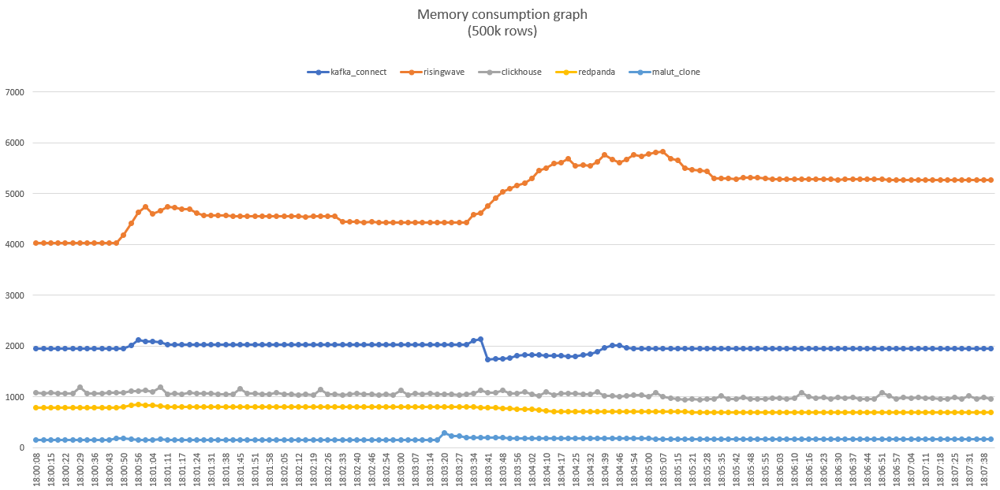
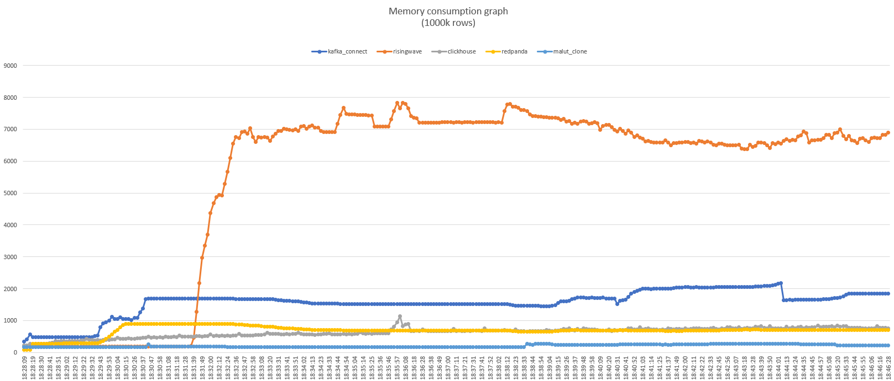
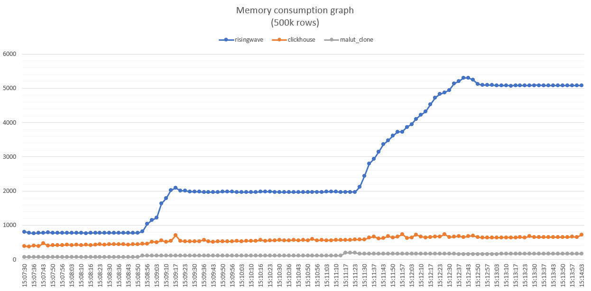
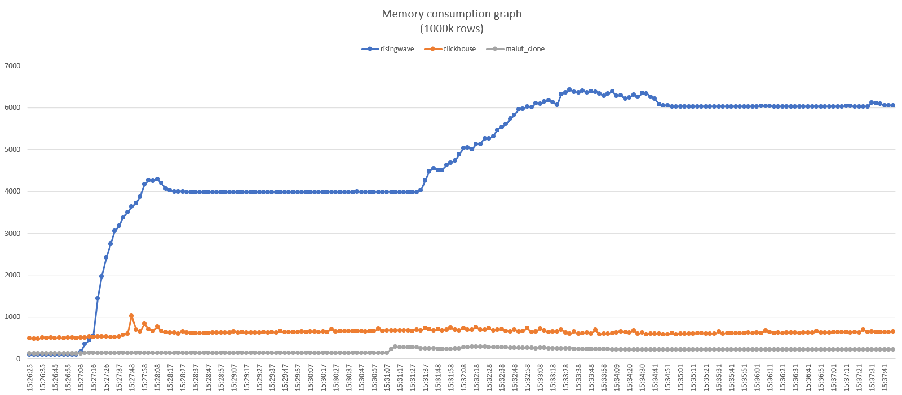

# OLAP Ingestion Comparison Report

## Overview

This report compares two architectures for ingesting and processing OLAP data.
The focus is on measuring **memory usage** under different insertion loads using a controlled Docker-based environment.

### Architectures Evaluated

1. **Debezium + Redpanda (CDC Streaming)**
   *Flow:* PostgreSQL → Debezium → Redpanda → RisingWave → OLAP

2. **Direct Approach**
   *Flow:* PostgreSQL → RisingWave → OLAP

---

## Test Setup

* **Database:** PostgreSQL (running with preloaded schema + data dump)
* **Workload:**

  * Create materialized view by joining multiple tables
  * Insert rows to trigger view updates
  * Test insertion sizes: **500k rows** and **1M rows**
* **Environment:** Docker containers for all components
* **Metric Collected:** Memory usage (per container, before and after insertions)

---

## Results

### 1. Debezium + Redpanda (CDC Streaming)

| Test   | Rows Inserted | Memory Before | Memory After | Notes |
| ------ | ------------- | ------------- | ------------ | ----- |
| Test A | 500k          | … MB          | … MB         | …     |
| Test B | 1M            | … MB          | … MB         | …     |

*Memory graph for 500k rows*

*Memory graph for 1000k rows*

---

### 2. Direct Approach

| Test   | Rows Inserted | Memory Before | Memory After | Notes |
| ------ | ------------- | ------------- | ------------ | ----- |
| Test A | 500k          | … MB          | … MB         | …     |
| Test B | 1M            | … MB          | … MB         | …     |

*Memory graph for 500k rows*

*Memory graph for 1000k rows*

---

## Observations

* Both architectures successfully handled **1M row insertion**.
* Memory usage patterns differed:

  * \[Highlight key differences, e.g., Debezium + Redpanda adds overhead due to streaming layer.]
  * \[Direct approach showed lower container count but higher memory spikes, etc.]

---

## Conclusion

* **Scalability:** Both approaches are capable of handling 1M row insertions.
* **Trade-offs:**

  * *Debezium + Redpanda*: Provides event streaming flexibility but adds memory overhead.
  * *Direct Approach*: Simpler, leaner setup with fewer moving parts.
* **Recommendation:** \[Fill in based on your team’s goals — e.g., streaming flexibility vs. resource efficiency.]
